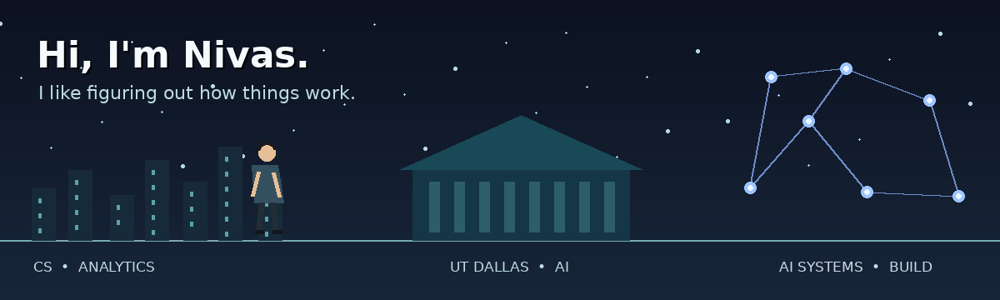

<div align="center">



<br/>

# Nivas Verelli

### AI Engineer · Builder · Creator

I like figuring out how things work — then figuring out how they could work better.

[](https://www.linkedin.com/in/nivasverelli)
[](https://www.youtube.com/@nivascaptures)
[](mailto:nivasv1019@gmail.com)
[](./assets/Nivas_Verelli_Resume.pdf)

</div>

---

## 01 / Right now

I’m interested in the point where **AI stops being a demo and starts becoming useful**.

That means building systems that can understand context, work with real data, survive outside notebooks, and make a measurable difference to the person using them.

```text
currently exploring → AI systems • agents • RAG • applied ML • evaluation • product thinking
always optimizing   → clarity • usefulness • reliability • the details
```

I care about clean engineering, but I care even more about whether the thing actually **works for someone**.

---

## 02 / Tech stack

### AI / Machine Learning


### Data / Engineering


### Cloud / MLOps


---

## 03 / Things I've been building

<table>
<tr>
<td width="50%" valign="top">

### Dynamic Pricing AI

A reinforcement-learning pricing engine built to reason over changing demand and inventory signals.

**What interests me about it:**  
pricing is not just prediction — it is a decision problem.

`Python` · `Reinforcement Learning` · `Optimization`

</td>
<td width="50%" valign="top">

### AI Shopping & Recommendation Agent

A natural-language shopping assistant that combines retrieval with contextual product recommendations.

**What interests me about it:**  
turning search into an actual conversation with intent.

`Python` · `NLP` · `RAG`

</td>
</tr>

<tr>
<td width="50%" valign="top">

### Healthcare Intelligence / Research

My earlier research explored how web applications, machine learning, and healthcare information systems can work together to make useful predictions and support decision-making.

It eventually became part of an **IEEE publication**.

`Research` · `Machine Learning` · `Healthcare`

</td>
<td width="50%" valign="top">

### The next experiment

There is almost always something being tested here.

Sometimes it becomes a project.  
Sometimes it becomes a lesson.  
Sometimes it gets deleted at 2 AM.

That is part of the process.

`Build` · `Measure` · `Question` · `Repeat`

</td>
</tr>
</table>

---

## 04 / Somewhere along the way...

```text
Computer Science & Engineering
            │
            ▼
   Analytics in Chennai
            │
            ▼
   Tiger Analytics
            │
            ▼
The University of Texas at Dallas
  M.S. Business Analytics & AI
            │
            ▼
 Applied AI / Data Science
            │
            ▼
 building what comes next...
```

I started in computer science, learned to think through data, moved deeper into machine learning and AI, and came to the U.S. for graduate school at **UT Dallas**.

I’ve worked around real analytical and AI problems along the way — including time at **Tiger Analytics** and **Walmart Global Tech** — but I’d rather let the projects tell most of that story than turn this page into a résumé.

---

## 05 / Research, ideas & learning in public

I enjoy the technical side of AI, but I’m equally interested in **why a system should exist in the first place**.

That curiosity has led me into:

- research and an IEEE publication
- AI and technology summits
- industry meetups and technical conversations
- writing about what I learn
- explaining careers, technology, and experiments online
- meeting people who are building things at a scale I want to understand

A surprisingly large part of my education has happened outside a classroom.

---

## 06 / Nivas Captures 🎥

<div align="center">

### Technology · Education · Careers · Conversations · Life

[](https://www.youtube.com/@nivascaptures)

</div>

**Nivas Captures** is where I document what I’m learning.

Sometimes that becomes an educational video.  
Sometimes a career breakdown.  
Sometimes a podcast or conversation.  
Sometimes I’m simply trying to explain something in the way I wish someone had explained it to me.

I don’t want to only consume interesting ideas.

I want to **test them, form an opinion, and share what I learn.**

---

<details>
<summary><b>07 / There is more to me than code...</b></summary>

<br/>

📸 **Photography** — I like noticing things people usually walk past.

🎬 **Movies** — good storytelling is one of my favorite forms of engineering.

🎙️ **Podcasts & conversations** — I enjoy hearing how other people arrived at the way they think.

🧠 **Tech summits & meetups** — I genuinely enjoy being around people who are building ambitious things.

🌎 **Exploring** — new places usually lead to new ideas.

🔍 **Details** — I have a hard time leaving something alone when I know it can be better.

I used to call that perfectionism.

Now I mostly think of it as **caring deeply about the work**.

</details>

---

<div align="center">

### I’m still figuring out where AI is going.

### That’s exactly why I want to be building in it.

<br/>

**Build. Question. Learn. Repeat.**

<br/><br/>

[LinkedIn](https://www.linkedin.com/in/nivasverelli) ·
[YouTube](https://www.youtube.com/@nivascaptures) ·
[Email](mailto:nivasv1019@gmail.com) ·
[Résumé](./assets/Nivas_Verelli_Resume.pdf)

<br/><br/>

<sub>Thanks for stopping by my corner of the internet.</sub>

</div>
